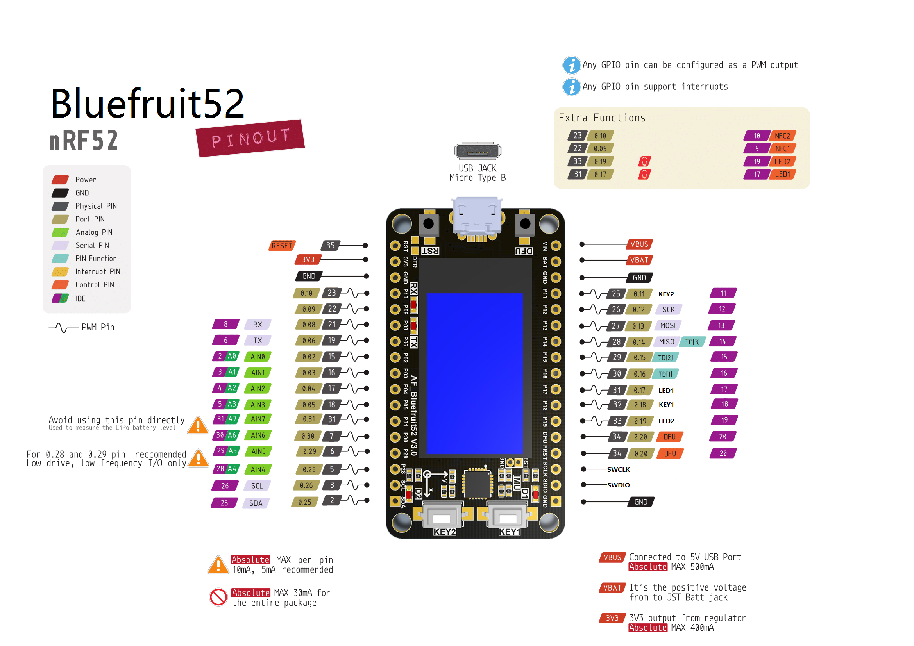
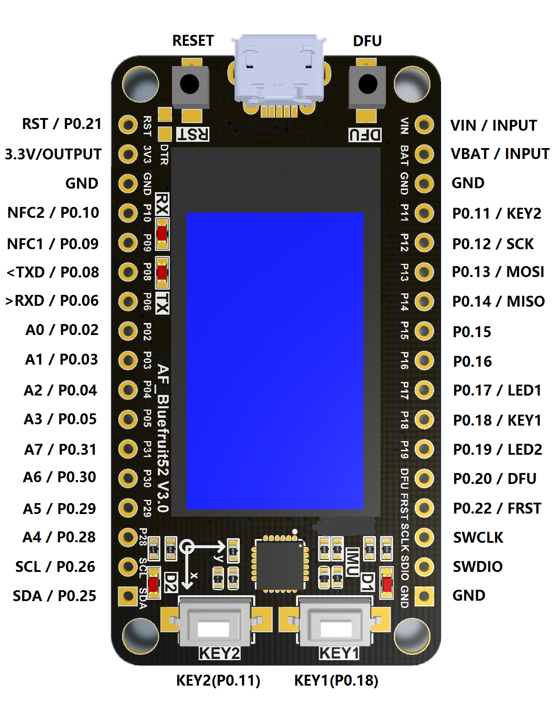

# nRF52832 Bluefruit 库

[English](../README.md) | 中文 | [日本語](docs/getting_started_ja.md)

## 1. 上手指南

*1.For MacOS*

* [Install the Bluefruit52 board for Arduino](https://www.afantor.cc/nRF52_bluefruit_Learning_Guide.html#arduino-bsp-setup)

*2. For Windows*

* [Install the Bluefruit52 board for Arduino](https://github.com/Afantor/Afantor_Bluefruit52_Arduino/tree/master/docs/getting_started_setting.md) 

## 2. 例程

https://github.com/Afantor/Afantor_Bluefruit52_Arduino/tree/master/examples

## 3. API 参考

https://github.com/Afantor/Afantor_Bluefruit52_Arduino/blob/master/src/bluefruit52.h#L49

https://www.afantor.cc/nRF52_bluefruit_Learning_Guide.html

## 4. H/W 参考

#### 管脚映射

*我们有几个不同版本的主控，可以直接查看原理图[对比](https://github.com/Afantor/Afantor_Bluefruit52_Arduino/tree/master/docs/hardware).*

**LCD & TF Card**

*LCD 分辨率: 135x240*

<table>
 <tr><td>nRF52 Chip</td><td>P0.07</td><td>P0.27</td><td>P0.16</td><td>P0.23</td><td>P0.24</td><td>~CS</td></tr>
 <tr><td>ST7789</td><td>SDA</td><td>SCL</td><td>DC</td><td>RST</td><td>CS</td><td>BL</td></tr>

</table>

**Button**

<table>
 <tr><td>nRF52 Chip</td><td>P0.18</td><td>P0.11</td></tr>
 <tr><td>Button Pin</td><td>BUTTON 1</td><td>BUTTON 2</td></tr>
</table>

**MPU6050**

<table>
 <tr><td>nRF52 Chip</td><td>P0.26</td><td>P0.25</td></tr>
 <tr><td>MPU6050</td><td>SCL</td><td>SDA</td></tr>
</table>

### M-BUS

#### Note:

* 如何安装 CP210x 串口驱动

  https://docs.m5stack.com/#/zh_CN/related_documents/establish_serial_connection

* 如何升级 Adafruit_nRF52_Arduino 库和 Afantor_Bluefruit52_Arduino 库

  https://docs.m5stack.com/#/zh_CN/related_documents/upgrade_m5stack_lib
