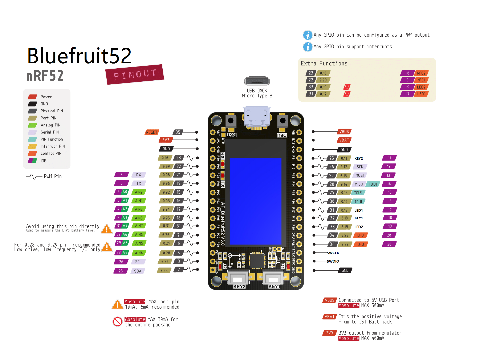
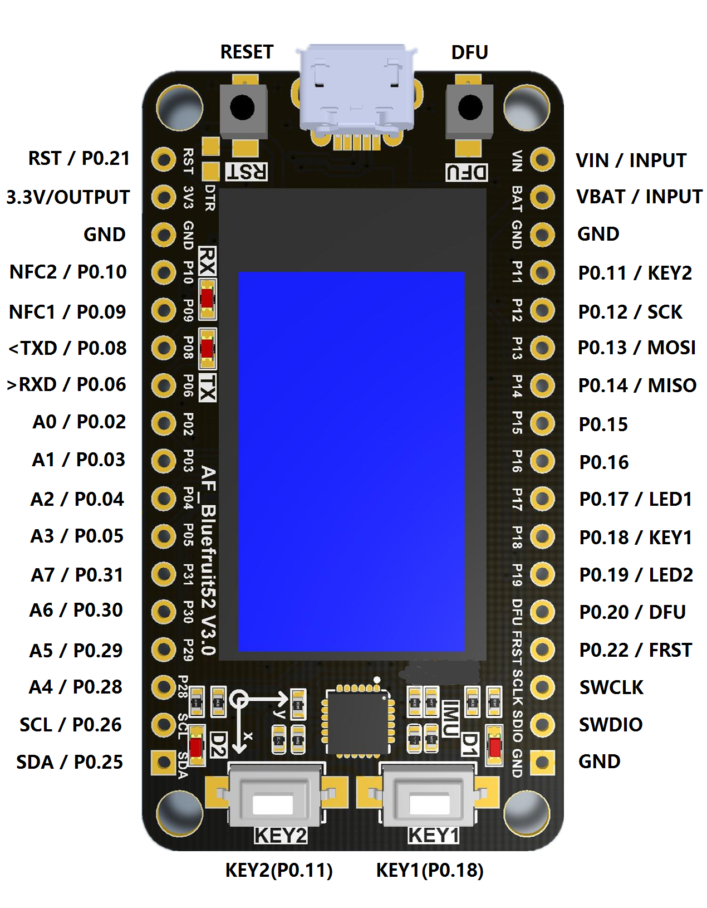

# nRF52832 Bluefruit Arduino Libraries

 These's examples for our nRF52832 based Bluefruit LE modules

[English](../README.md) | [中文](getting_started_cn.md) | 日本語

M5Stack Core のライブラリへようこそ

## 1. 始めよう

#### M5Stackの開発環境を構築しよう

*1.MacOS環境*

* [Install the Bluefruit52 board for Arduino](https://www.afantor.cc/nRF52_bluefruit_Learning_Guide.html#arduino-bsp-setup)

*2.Windows環境*

Coming soon...

## 2. プログラム例

https://github.com/Afantor/Afantor_Bluefruit52_Arduino/tree/master/examples

## 3. 関数リファレンス（API仕様）

https://github.com/Afantor/Afantor_Bluefruit52_Arduino/blob/master/src/bluefruit52.h#L49

## 4. ハードウェア仕様

#### I/Oインタフェイス 

*nRF52は複数のバリエーションがあります。違いは [こちら](https://github.com/Afantor/Afantor_Bluefruit52_Arduino/tree/master/docs/hardware)*

**LCD**

*LCD 解像度: 135x240*

<table>
 <tr><td>nRF52 Chip</td><td>P0.07</td><td>P0.27</td><td>P0.16</td><td>P0.23</td><td>P0.24</td><td>~CS</td></tr>
 <tr><td>ST7789</td><td>SDA</td><td>SCL</td><td>DC</td><td>RST</td><td>CS</td><td>BL</td></tr>

</table>

**ボタン**

<table>
 <tr><td>nRF52 Chip</td><td>P0.18</td><td>P0.11</td></tr>
 <tr><td>Button Pin</td><td>BUTTON 1</td><td>BUTTON 2</td></tr>
</table>

**MPU6050**

<table>
 <tr><td>nRF52 Chip</td><td>P0.26</td><td>P0.25</td></tr>
 <tr><td>MPU6050</td><td>SCL</td><td>SDA</td></tr>
</table>

### M-バス

## 5. 素晴らしい応用例

* [App-Controller](https://github.com/Afantor/Afantor_Bluefruit52_Arduino/tree/master/examples/Peripheral/controller)  この例は、BLEUartヘルパークラスとBluefruit LE Connectアプリケーションを使用して、ベースのキーパッドとセンサーデータをnRF52に送信できることを示しています。