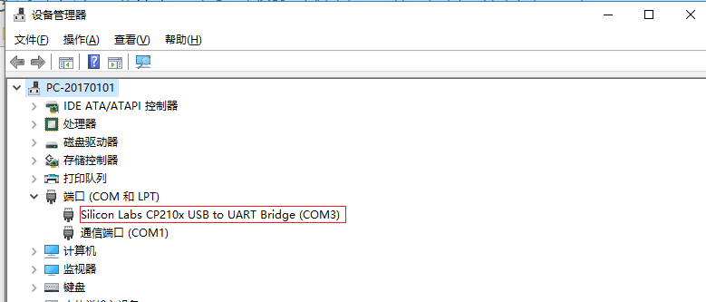
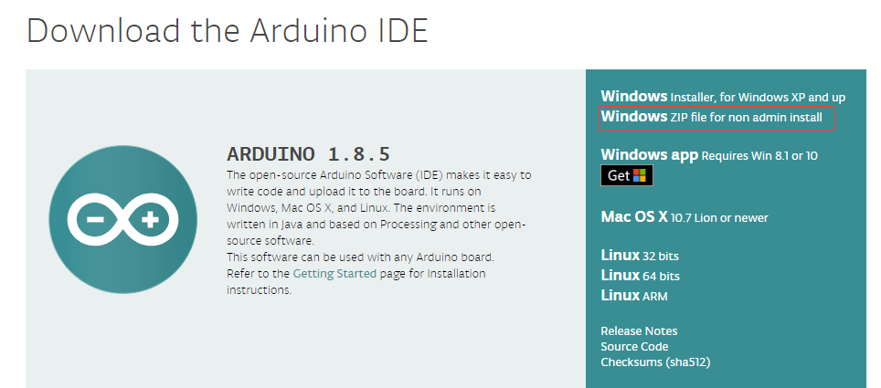
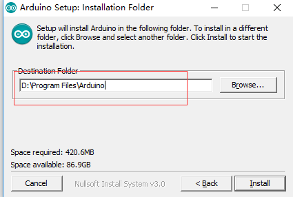
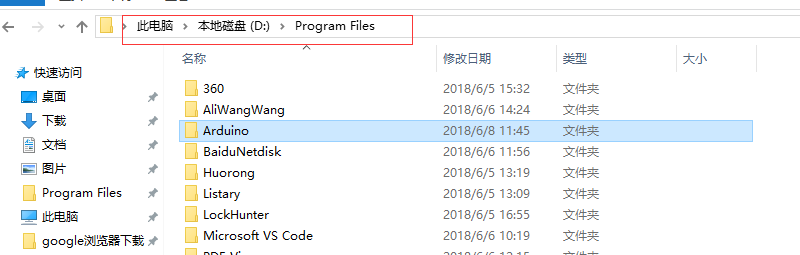
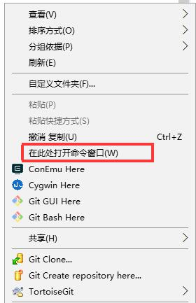
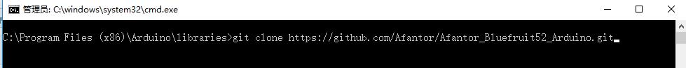

# nRF52832 Bluefruit Arduino — 快速上手


## 一、安装 USB 驱动

点击以下链接，下载 nRF52832 Bluefruit52的 USB 转串口驱动CP2102

https://www.silabs.com/products/development-tools/software/usb-to-uart-bridge-vcp-drivers

下载完之后，解压，根据系统位数，双击对应可执行文件

(Windows 32位，执行 CP210xVCPInstaller_x68.exe；Windows 64位，执行 CP210xVCPInstaller_x64.exe；)

*判断驱动安装是否成功：*
如果安装成功，在插入 Bluefruit52 主控之后，设备管理器如下图所示出现，Silicon Labs 的 CP21x 系列串口端口号
(我的电脑当前串口号是 COM3)




## 二、开发环境
## **Windows**
### 1、安装 Arduino IDE

*下载地址*
https://www.arduino.cc/en/Main/Software 




如下图所示修改 Arduino 路径为 D:\Program Files




此时，Arduino 的安装路径为 D:\Program Files\Arduino




### 2、下载 Afantor nRF52832 支持包

（我的 Arduino 当前路径是 D:\Program Files\arduino）

进入 Arduino 安装路径的 libraries 文件夹，按住 Shift 键的同时，右键选择“在此处打开命令窗口”，打开CMD命令窗口，使用“git clone ”

命令远程下载Afantor nRF52832库包。





### 3、下载安装 nRF52832 编译链工具

打开Arduino IDE，进入“文件”菜单下的“首选项”；

在“附加开发板管理器网址”中增加 https://www.adafruit.com/package_adafruit_index.json

然后关闭IDE，重新打开Arduino IDE；

进入“工具”菜单栏，打开“开发板管理器”，等待联网更新数据，完成后在搜索框中搜索：nrf52

找到“Adafruit nRF52”，点击安装即可，等待时间会很久，请不要关闭Arduino。

安装完成后，打开“工具”菜单下，选择“开发板”，找到“Adafruit nRF52832 Boards” 下的 “Adafruit Bluefruit nRF52832 Feather”，环境即搭建完成。


### 4、打开Arduino IDE 验证Adafruit_nRF52_Arduino和Afantor_Bluefruit52_Arduino 的库

打开Arduino IDE，选择“Adafruit Bluefruit nRF52832 Feather”开发板，进入“文件”菜单下的“示例”，找到“Adafruit Bluefruit nRF52 Libraries” 和 “Afantor Bluefruit52” 里面即是例程库。

## 三、示例

USB 线连接 Bluefruit52 主控，选择串口和一个示例程序，compile and upload

### 1、打开一个示例程序，如打开 blinky.ino


确认连接板子名称、和当前串口号分别：COM3(当前电脑串口号)


编译运行成功之后，串口监视窗口显示如下


### 2、新建一个 nRF52832 程序

打开 Arduino IDE 之后，新建 .ino 文件，并保存为 my_test.ino

将如下代码拷贝进文件中。

```cpp
#include <bluefruit.h>
#include <bluefruit52.h>
// the setup routine runs once when Bluefruit52 starts up
void setup(){

  // Initialize the Bluefruit52 object
  BF52.begin(true, true, false);

  // LCD display
  BF52.Lcd.fillScreen(BLACK);
  BF52.Lcd.setTextColor(YELLOW);
  BF52.Lcd.setTextSize(2);
  BF52.Lcd.println("Hello World!");
  BF52.Lcd.println("Bluefruit52 is running"); 
  BF52.Lcd.println(" successfully!");   
}

// the loop routine runs over and over again forever
void loop() {

}
```

点击编译运行下载，此时 Bluefruit52 显示器显示 "Hello World!" "Bluefruit52 is running successfully!"


